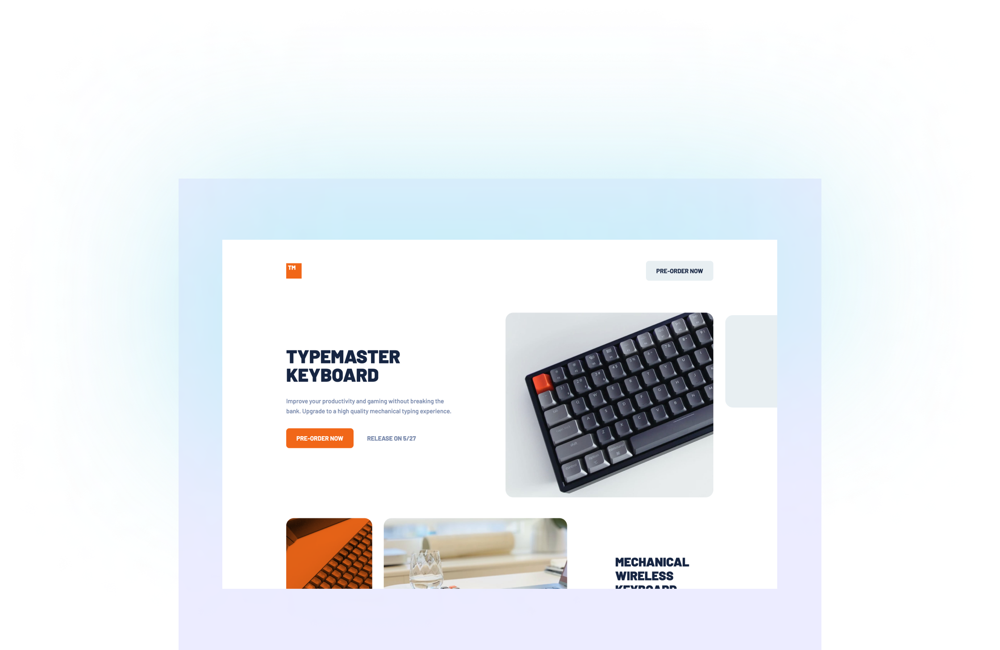

# HTML & CSS Portfolio Project - Typemaster Pre-Launch Landing Page

This project is the final official portfolio project for the HTML & CSS course in the AmaliTech Training.

## Table of contents

- [Overview](#overview)
  - [The challenge](#the-challenge)
  - [Screenshot](#screenshot)
  - [Links](#links)
- [My process](#my-process)
  - [Built with](#built-with)
  - [What I learned](#what-i-learned)
  - [Useful resources](#useful-resources)
- [Author](#author)

## Overview

### The challenge

The challenge was to build out this pre-launch landing page with code and get it looking as close to the design as possible

Users should be able to:

- View the optimal layout on their device's screen size
- See hover states for interactive elements

### Screenshot

### Links

- Live Site URL: [Typemaster Pre-Launch Landing Page](https://larbidanquah.github.io/typemaster-pre-launch/)

## My process

### Built with

- Semantic HTML5 markup
- CSS custom properties
- Flexbox
- CSS Grid
- Mobile-first workflow

### What I learned

I learnt a lot working on this project and the one thing that stuck with me was the ability to identify every element of the website as a box. It really helped me in structuring the content to best suite the design specification. I also had fun applying the knowledge I gained learning Flexbox and Grid. It helped make the implementation of the design a breeze.

### Useful resources

- [The MDN Web Docs](https://developer.mozilla.org/en-US/docs/Learn/CSS/CSS_layout/Flexbox) - The MDN docs is mainly my goto. With this project, I used it a lot to gain some insights on some flexbox concepts.
- [W3Schools](https://www.w3schools.com) - W3Schools has also helped me alot not only in this project but ever since I started web development. I still use it to this day.

## Author

- Website - [Samuel Larbi Danquah](https://github.com/larbiDanquah)
- Twitter - [@builtbysam](https://www.twitter.com/builtbysam)
